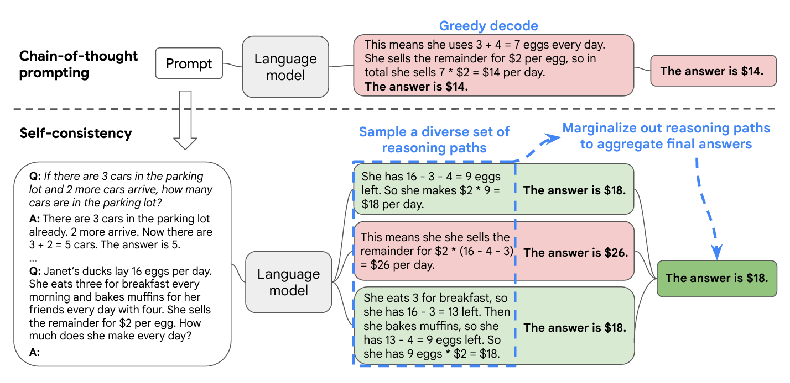
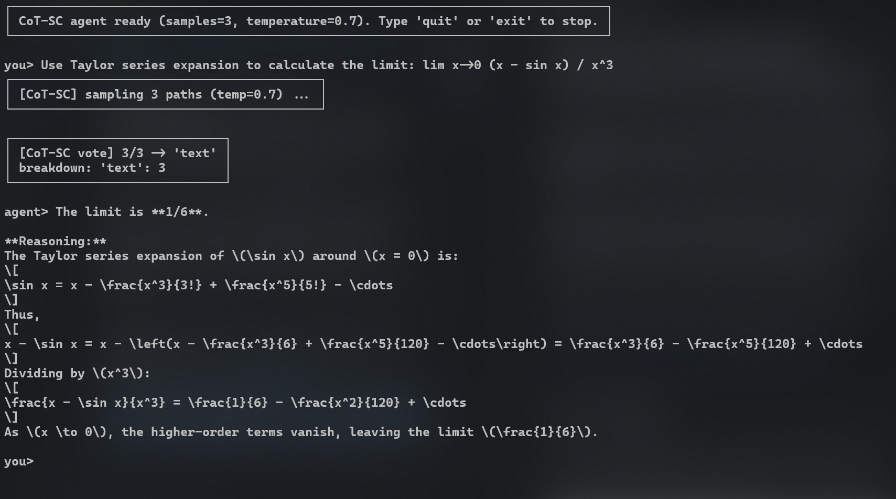
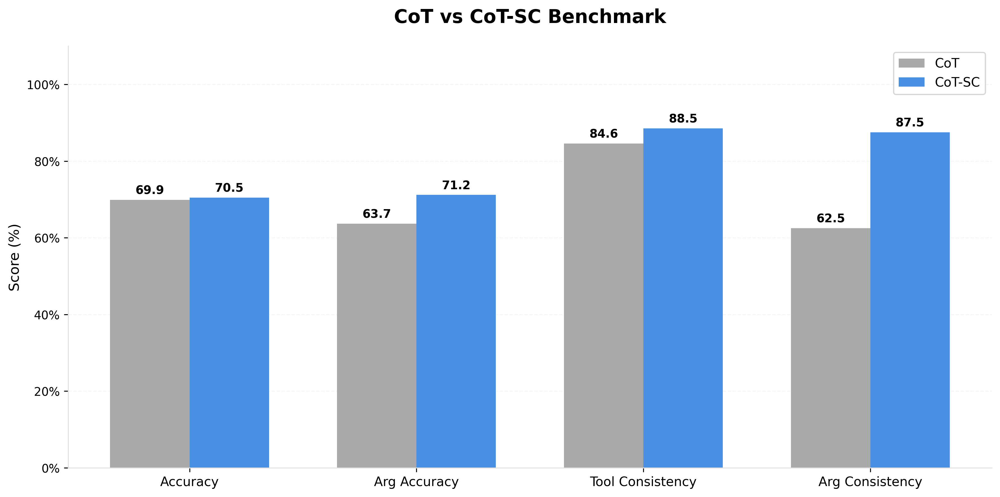

# Chain-of-Thought Self-Consistency for LLM Agents

A lightweight, plug-and-play **implementation** of **Chain-of-Thought Self-Consistency** (CoT-SC) that provides a faithful **replication** of the original paper's logic for any **LLM API**.

Instead of trusting a single reasoning path, CoT-SC samples **N independent chains of thought in parallel** and picks the most agreed-upon answer via majority voting — dramatically improving reliability on complex tasks.

> **Paper**: Wang et al., *"Self-Consistency Improves Chain of Thought Reasoning in Language Models"*, ICLR 2023.  
> [https://arxiv.org/abs/2203.11171](https://arxiv.org/abs/2203.11171) | [Local PDF](docs/Self-Consistency%20Improves%20Chain%20of%20Thought%20Reasoning%20in%20Language%20Models.pdf)

---

## How It Works

The following diagram from the original paper illustrates the core concept: multiple reasoning paths are sampled and then aggregated via majority voting.



---

### Implementation Logic

Our implementation follows this workflow (simplified):


Key ideas:
- **Parallel sampling** — all N paths run concurrently via `llm.batch()`, so latency is roughly the same as a single call.
- **Fingerprinting** — tool-call responses are reduced to a canonical key that captures intent, not wording, so near-identical calls count as the same vote.
- **Conservative fallback** — when there is no strict majority, a plain-text answer is preferred over a stochastic tool selection.

---

## Interactive Agent

We provide a **LangGraph-powered interactive agent** that wraps the CoT-SC logic, allowing for a conversational interface with persistent system prompts defined in [AGENT.md](AGENT.md).



### Features
- **Conversational** — Maintains reasoning quality across multi-turn interactions.
- **Customizable Prompt** — Centrally managed system instructions in `AGENT.md`.
- **Streaming-like Output** — Progressive terminal display for a better UX.

### How to Run

Requires `.env` with: `LLM_API_KEY`, `LLM_BASE_URL`, `LLM_MODEL`, `COT_SC_SAMPLES`, `COT_SC_TEMP`.

```bash
# from project root
python src/agent.py
```

```bash
# standard script entrypoint
uv run --with-editable . cot-sc-agent
```
---

## Benchmarks

Evaluation on private dataset shows that CoT-SC significantly outperforms standard Chain-of-Thought (CoT) by reducing stochastic errors and improving logical consistency.



---
